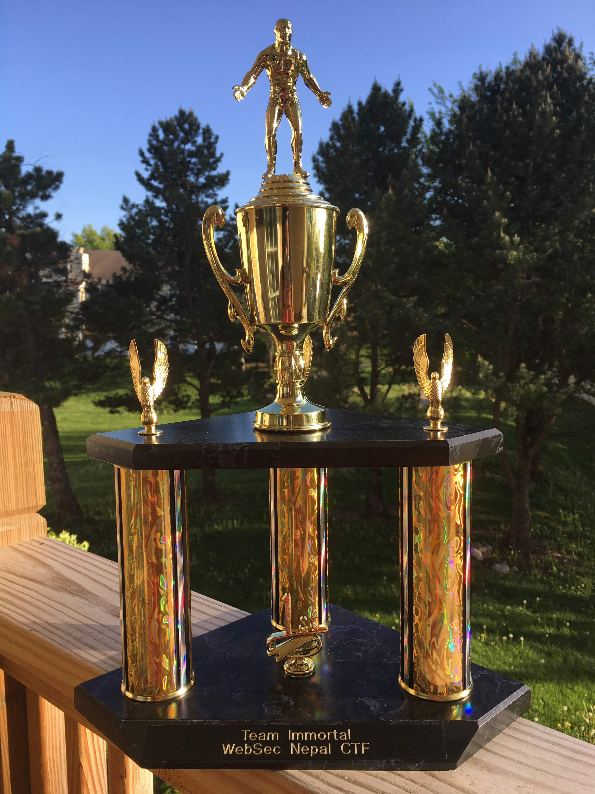

# ctf-writeups
> CTF writeups for the CTFs and Vulnerable Boxes I play with sometimes

### CTFs

- [CSharp : VulnJSON](csharp-vulnjson.md)
- [Primer](primer.md)
- [SickOS 1.1](sickos-oscp-like.md)
- [The Wall](the-wall.md)
- [WebSec CTF](websec-ctf.md)

### Awards

#### Websecctf organized on April 2017 sent me a trophy for winning the CTF. Below is the picture:

