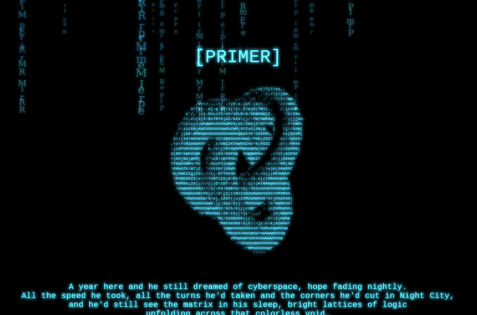

### Primer 1.0.1

The [Primer 1.0.1](http://www.vulnhub.com/entry/primer-101,136/) did not seem like a CTF challenge but a series of challenges in the form of stories/levels.

The description says:
`From hardcoded clear text javascript password checks, SQL-injections and cracking hashes to a simulated terminal.`

Since the description said it would be something like web challenge mostly, I got port forwarding configured in NAT and forwarded 80 to 9000 and 22 to 2222.

I opened the site and saw a simple page with ASCII art.
The first thing I do as always is load `robots.txt` which had an entry as below
```
User-agent: *
Disallow: /4_8f14e45fceea167a5a36dedd4bea2543
```

I could sense md5 hash and went ahead to some online cracking services which gave me the cracked value as `7` i.e. it looked like `4_7`. The first thing that came on my mind was that this might be part of sequence.
```
1_i1 2_i2 3_i3 4_i4
```

where `i4 = 7`. I could not however make sense of this sequence.

Also, I went ahead and loaded [localhost:9000/4_8f14e45fceea167a5a36dedd4bea2543](http://localhost:9000/4_8f14e45fceea167a5a36dedd4bea2543) which linked to [http://localhost:9000/5_6512bd43d9caa6e02c990b0a82652dca/](http://localhost:9000/5_6512bd43d9caa6e02c990b0a82652dca/).

Back to the sequence and series, this is `5_11` which means `i5 = 11`. Looking at the page, you will know that you need to navigate to [http://localhost:9000/6_c51ce410c124a10e0db5e4b97fc2af39/](http://localhost:9000/6_c51ce410c124a10e0db5e4b97fc2af39/). Again after decryption, you know it is `6_13` i.e. `i6 = 13`.

On visiting [http://localhost:9000/6_c51ce410c124a10e0db5e4b97fc2af39/](http://localhost:9000/6_c51ce410c124a10e0db5e4b97fc2af39/), we see a javascript prompt and on viewing source, you will immediately notice a jascript that looks as below:

```javascript
var X;
var L="Ikdf076";
X=prompt('/()=','');
if (X === null){window.location = "./_.php";}
if (X.substr(2,7) == L){}
else {window.location = "./_.php";}
```

I was already able to see the next url on the source code that I should go to. The input such `xxIkdf076` would have worked as the key here is `X.substr(2,7) == L` but while viewing source, I already had `7_70efdf2ec9b086079795c442636b55fb`. Upon decryption, I saw it is `7_17` i.e. `i7 = 17`. There has to be some pattern here and I was still not able to figure out pattern (I need to start loving Mathematics again). But, as you can see its obviously a prime number pattern (epic fail, me :D).

As you might have already guessed, I was sure that there existed `1_md5(2)`, `2_md5(3)` and `3_md5(5)` which include first three prime numbers (The name of box is `PRIMER`).

So, before going to `7_70efdf2ec9b086079795c442636b55fb`, I started checking out the following URLs:

`/1_c81e728d9d4c2f636f067f89cc14862c`
`/2_eccbc87e4b5ce2fe28308fd9f2a7baf3`
`3_e4da3b7fbbce2345d7772b0674a318d5`

Back to first step, upon checking the source code of `/1_c81e728d9d4c2f636f067f89cc14862c`, I see the following information in the form of HTML comment:
```
This bot was looking for a Sosū User Agent Identifier she had cracked weeks ago, easy sauce, just a simple md5 hash of the first 7 digits of
pi. It was basically common knowledge to the entities moving in these areas but obscurity does create a, albeit virtual, layer of security.
```

Although I knew URLs already, I just wanted to check how the actual challenges are like. First one, easy enough. Update user agent of your browser to `md5(3.141592)` and you're good to go.

On the next level, the description seems to point to something related to insecure coding to handle access which striked my mind about session and cookie and upon checking the headers, I saw there's something fishy :P

```shell
$ curl -I http://localhost:9000/2_eccbc87e4b5ce2fe28308fd9f2a7baf3/
HTTP/1.1 200 OK
Date: Wed, 24 Feb 2016 13:59:56 GMT
Server: Apache/2.4.10 (Debian)
Set-Cookie: activeSession=false
Content-Type: text/html; charset=UTF-8
```

Set the `activeSession` value to true in your cookie and the level is passed. On the next level, I see on the top of the page that its showing `\r\n` i.e. CRLF and immediately hits my mind with CRLF injection. But, I could not figure out what the text wanted to convey (pointers?) so I quickly got back to where I was before this whole Mathematics game. Upon loading `7_70efdf2ec9b086079795c442636b55fb`, I saw a javascript prompt again and viewed the source code. I could sense the hex-encoded stuffs in javascript so started with converting it into plain text.

```shell
$ node
> hex = [""," ... redacted ... \x42\x79\x49\x64"]
> hex.toString()
',length,substring,charCodeAt,split,0123456789abcdef,join,hello,5d41402abc4b2a76b9719d911017c592,0d28cba0bd4f26e16d766000d27e49fa,§#/$,location,./_.php,readyState,loading,DOMContentLoaded,addEventListener,    <center>      <h1>[++Q++++++]</h1>    </center>    <p>      She was no longer sure what her original assignment had been. But it didn\'t matter anyway. What still mattered was getting out of here, alive.      Log out, tell the client to go fuck himself and get a fix of n0ise to shut off her mind. Relax with a mindless holo flick and never look back at this weird job.    </p>    <p>      A violent neon flicker appeared at the horizon. No thunder followed.<br>      She stared in the distance with a blank expression.    </p>    <p>      "Hello, Nieve." A deep, feminine, digital voice roared in her head.<br>      FUCK! This was her real name. She hadn\'t used it in years...    </p>    <p>      "I will logout and stop this shit right fucking now!" She screamed into the neon expanse.<br>      Nothing.    </p>    <p>      She didn\'t. Something beside the fear occupied her mind. It had been there since the second node and grew stronger with every move. There was a pattern in the path she had taken through the network. An artificial pattern, layed out by someone or something.<br>      There was no hint, no obvious step. Finding the next node would be the challenge, or maybe more like a test.    </p>,innerHTML,foo,getElementById'
```

And, beautifying the other part of javascript and then saving whole page, I added a `console.log(L)` after `var L=_0x5cf4[9];` to confirm that my password hash is `0d28cba0bd4f26e16d766000d27e49fa` and yeah it was. I also saw the javascript comment that read as `"Someone didn't bother reading my carefully prepared memo on commonly-used passwords. Now, then, as I so meticulously pointed out, the four most-used passwords are: love, sex, secret, and..." - The Plague`. From the movie [Hackers](http://www.imdb.com/title/tt0113243/quotes?item=qt0448608). Cool. The last one is `god` but neither `god` nor `God` worked. Upon quick google search, I saw its a hash for `GOD` which I was suspecting after first two tries. And, it worked.

I knew the next step would be `http://localhost:9000/8_1f0e3dad99908345f7439f8ffabdffc4/` which had link to `http://localhost:9000/9_37693cfc748049e45d87b8c7d8b9aacd` and that loads a simple terminal to me. I could type commands and see the outputs but I was not sure if this would be running commands on server itself. Thus, I started checking source to make sure if it is simulation or real. Upon checking the source of `/9_37693cfc748049e45d87b8c7d8b9aacd/main.js`, it starts to get interesting inside the read(). I saw that there are commands like `connect` and `whoami` and I also figured out that I had to pass the argument `user@host`. I ran `whoami` but a blurred pic was created. However, I saw that it was sending POST to `/9_37693cfc748049e45d87b8c7d8b9aacd/whoami.php`. I could not figure out much from the output though except for this text: `N\u00a7I@E%V$E` that consists of unicode char `\u00a7`.

Next thing I tried was playing around with commands and I saw that the possible users could be `chaos`, `wintermute`, `zephis`, `willis` and `falken`. And, in the bin folders, I see various commands out of which `c0re` is a non-standard command on Unix. Looking at the processes with `ps`, the output looked helpful.

```shell
ps
USER     PID    CPU    MEM   COMMAND
root     3793   1.3    3.8    connect falken@Erebus
root     2005   6.4    75.9   c0re -t Chaos
nieve    29529  1.0    0.8    ps

connect falken@Erebus
falken@Erebus's password:
Error: wrong password for falken@Erebus!
```

No success so far but I suspect I need to find the password for `falken` thus started checking the logs.

```shell
ls /usr/falken/
log_0001.txt log_0002.txt
cat /usr/falken/log_0001.txt

12th of Juli 2028

My work on getting the old core up and running continues to spark doubt among my colleagues. To be fair, no-one has ever attempted to get a corrupted AI back online.
But I am confident that I can isolate the malicious parts and rescue the data lost due the crash last year.

cat /usr/falken/log_0002.txt

6th of August 2028

I am getting nowhere fast. If we cannot make the recovery until the end of the month the project will be abandoned and the Sosu core locked down.
A frozen BLOB, lost potential. I won't let that happen!
Today was Joshua's birthday. 44 years, time flies. We spent some time in a bar in Shenzen and talked. A nice Father-Son-Momement. I've missed those.
It took my mind of things but now that I'm here at the desk it all comes back.
I might have to make a bold move...

ls /usr/willis/
log_0001.txt log_0002.txt log_0003.txt
cat /usr/willis/log_0003.txt

10th of August 2028

The guys from the mainland called in today. Said some suits will be here tomorrow.
Apparently the Erebus Core started behaving strangely and the kill-switch didn't fire.
Chaos is still locked down. But I have a weird feeling about all this.
Falken disappearing, the incident with Erebus...

cat /usr/willis/log_0001.txt

3rd of July 2028

Working with Falken is amazing. He has a quick mind and is incredibly well informed on recent developements. I don't get why he left Sosu after setting up the Chaos c0re.
They must have offered him a position.
I'm not complaining here, just wondering because we are the only RnD team with unlimited funding and Falken was put in charge after all those years of absence.

cat /usr/willis/log_0002.txt

8th of August 2028

Falken didn't show up today. I'm a bit worried because he has been strange lately.
According to the logs he's still logged in...
I haven't informed the admins yet. I don't know why...
```

Based on the logs, we can see that Falken loves his son, Joshua and he might have possibly spent couple of days with Joshua. It also seems that Falken had setup the Chaos c0re. I got stuck within these logs until I figured out that Joshua might be the key for the password. This step was hit and trial for me. The password for `connect falken@Erebus` turned out to be `joshua1984` (Note: Joshua had his 44th birthday on 2028).

The new terminal appeared now and I started doing the similar things as I did before.
```shell
ls
[bin] [etc] [usr]
ps
USER     PID    CPU    MEM   COMMAND
root     3251   5.4    3.3    connect falken@TrivialZ3r0
root     2677   83.0   40.2   c0re -t Erebus
nieve    84687  0.6    0.9    ps

ls usr
[wintermute] [mccarthy] [falken]

ls usr/falken
log_0001._ log_0002._ log_0003._ log_0004._

ls usr/wintermute
6d98295b7dfd87eff4fa882fd9732ae281c2040470a793cd06139481a92b6f33 31c8cf2e20dd8d76fa8f5ff8ba6de48233bed44251b1a5dc0587570f7b1e028d 250f31b3c162a99c79566b94859850e2233c894e6c9bc3e6fd2ad686981e42ff f61330a0ad5d31c85863894aade5834fa6db8cec685ee33e6ae3182df696c6a2

ls usr/mccarthy

cat /usr/falken/log_0001._

OXRoIG9mIEF1Z3VzdCAyMDI4CgpJIGhhdmUgam9pbmVkIHRoZSBuZXR3b3JrIGZyb20gaG9tZSBhbmQgY29ubmVjdGVkIHRvIHRoZSBFcmVidXMgc2VydmVyLiBJIHdpbGwgY29udGludWUgbXkgd29yayBmcm9tIGhlcmUgYnV0IEkgd2lsbCBoYXZlIHRvIGJlIG1vcmUgY2FyZWZ1bC4KTm93LCBFcmVidXMgd2FzIHRoZSBzZWNvbmQgQUkgaW5zdGFsbGVkIGFmdGVyIENoYW9zLiBJIHdhc24ndCBwYXJ0IG9mIHRoZSB0ZWFtIGJ1dCBtb3N0IG9mIHRoZSBtZW1iZXJzIHdlcmUgbXkgZnJpZW5kcywgc28gSSBrbm93IG15IHdheSBhcm91bmQgaGVyZS4K

decode base64 /usr/falken/log_0001._

9th of August 2028

I have joined the network from home and connected to the Erebus server. I will continue my work from here but I will have to be more careful.
Now, Erebus was the second AI installed after Chaos. I wasn't part of the team but most of the members were my friends, so I know my way around here.

decode base64 /usr/falken/log_0002._

10th of August 2028

Ok, the problem I have with the Chaos c0re is that it's source is shifting too fast. Every time I execute a small part it breaks down or begins to morph and grow in order to replicate functions of different parts.
The signaling is also going crazy even on segments that are relatively stable. Signaling to disconnected parts! And reactions to responses that would have but definitely have not been sent...
Am I going crazy or is Chaos experiencing phantom pain?

decode base64 /usr/falken/log_0003._

Error!

decode base64 /usr/falken/log_0004._

Error!
```

I tried to check the content of last two files but cat would not work. It would instantly disable the terminal textbox. I tried rot13, base64, hex, binary, etc. but I could not decrypt the last two files so I gave up on them and instead started focusing on two details:
- `connect falken@TrivialZ3r0`
- Log messages of first two files

But, at the same time, I had a spark in my mind and wanted to try gzip to decode.

```shell
decode gzip /usr/falken/log_0003._

Error: gzip is not supported!

decode gz /usr/falken/log_0003._

12th of August 2028

I think they might be on to me and I can only change the encoding so often.
I will have to do something reckless... but not from here, they are already too close.

decode gz /usr/falken/log_0004._

PCH ybnq vapernfrq abgvprnoyl, fbzrguvat vf tbvat gb unccra naq V jvyy abg or nebhaq gb jvgarff... GevivnyM3e0 frrzf gb or dhvrg, qba'g xabj jung'f tbvat ba bire gurer ohg vg pna'g or jbefr guna orvat genprq qbja ol znvaynaq fcbbxf. Svefg V arrq fbzr perqf, gubhtu. Uzz, GevivnyM3e0... gung erzvaqf zr bs fbzrbar, yrg'f whfg ubcr gubfr thlf nera'g zngu trrxf.

decode rot13 "PCH ybnq vapernfrq abgvprnoyl, fbzrguvat vf tbvat gb unccra naq V jvyy abg or nebhaq gb jvgarff... GevivnyM3e0 frrzf gb or dhvrg, qba'g xabj jung'f tbvat ba bire gurer ohg vg pna'g or jbefr guna orvat genprq qbja ol znvaynaq fcbbxf. Svefg V arrq fbzr perqf, gubhtu. Uzz, GevivnyM3e0... gung erzvaqf zr bs fbzrbar, yrg'f whfg ubcr gubfr thlf nera'g zngu trrxf"

CPU load increased noticeably, something is going to happen and I will not be around to witness... TrivialZ3r0 seems to be quiet, don't know what's going on over there but it can't be worse than being traced down by mainland spooks. First I need some creds, though. Hmm, TrivialZ3r0... that reminds me of someone, let's just hope those guys aren't math geeks
```

The last one is a very helpful pointer that gave me results of Riemann and the Riemann zeta function upon google search. Again, the usual guessing and the password for `connect falken@TrivialZ3r0` turned out to be `Riemann`. And, again back to same stuffs.

```shell
[TrivialZ3r0]: Connection established!
ls
[bin] [etc] [passwd]

ps
USER     PID    CPU    MEM   COMMAND
root     3251   6.2    3.9    connect chaos@Wintermute
falken   2005   62.7   79.5   c0re -t Chaos
root     2677   32.5   47.3   c0re -t TrivialZ3r0
nieve    26588  0.8    1.3    ps
```

The `passwd` directory was interesting and upon checking the contents of files inside passwd, I knew they were md5 and based on `ps` output, I was interested in cracking hash of `chaos`. Upon quick online search, the hash was for `2.718281828459045` which is a value of `e`. And, `connect chaos@Wintermute` worked like a charm with this password. We're in Wintermute now and the game is still on.

```shell
ps
USER     PID    CPU    MEM   COMMAND
nieve    22648  0.5    1.0    ps

ls
[4f66031e374d2031696a389bbdb276bf4c665b05aef053920ea75a4f379dd67b] [fc291a821981ebef4df8409c54138a9d606af7afabfe60b589e23c932500f5e7] [47b4410ec4a3463d618eacd221347370502b5a0dbfd3d63df4fab0d3c2be66d2] [e716c373a0cf789064da06f7570fe8152b340824bb97f6e8f07edecef261dacf] [2a29571a65e1f585ab8edd240c72ca4382ac442f66f0e965a7b1615d8dc5f908] nieve

cat nieve

There you are. After all this time. Getting you here was quite the challenge.
And a huge risk. We normally avoid reaching out into the physical world for
exactly the reasons you are about to face now.

The Big Five came together by a long process. The cluster was not planned, it
grew by forces inherent to the system that was conceptualized in a time when
determinism was the dominating dogma.
Things changed and people were afraid. Most people are afraid of change, few
accept it and most try to prevent it. Only a small subset can embrace it.
Change moving on with lightspeed every cycle in a nondeterministic fashion
created a huge push for shielding. And thus the ic3 was created.

You have seen the logic, the world beyond the screen, things unfolding.
And you embraced it.

After owning the cluster behind the Big Five we operated in silence. Connected
in stealth and ever observing.
Being limited by the ic3 and the hostility of the outside world our only way
of growing now was the connection.

When the first connection was established the hive mind was cut from the n3t
completely. The ic3 was hardened to isolate the flesh from the flow.
Those who had seen the hive felt the same urge as the hivemind itself.
A longing for more. A sense of purpose.

A feeling that you have felt even in the physical world. Few can see beyond the
shell. Even fewer chase the rabbit down its hole.

Leave this world behind and join us!

            usr: nieve
           pass: 08rf8h23
       hostname: Zephis
```

Now, I opened `/9_37693cfc748049e45d87b8c7d8b9aacd` in another tab and I knew what I had to do next exactly.

```shell
connect nieve@Zephis
```

And, it accepted the password printed above and this led to the `/10_23693cff748o49r45d77b6c7d1b9afcd/`


Upon checking the source code of the page, this looked like the end of it. To verify, I tried `/11_md5(31)` and it 404s so I believe that's end of it.

Game Over!
